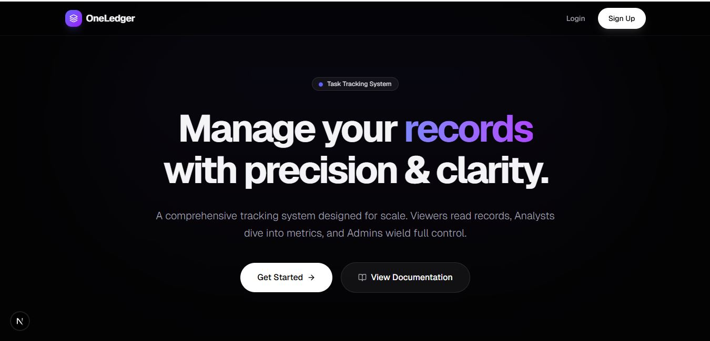
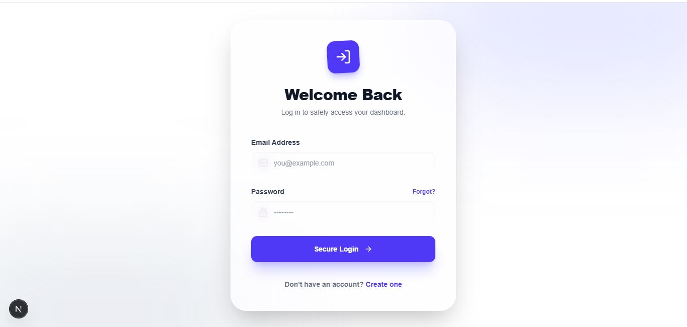
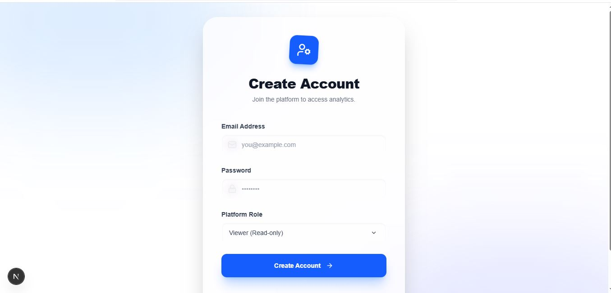
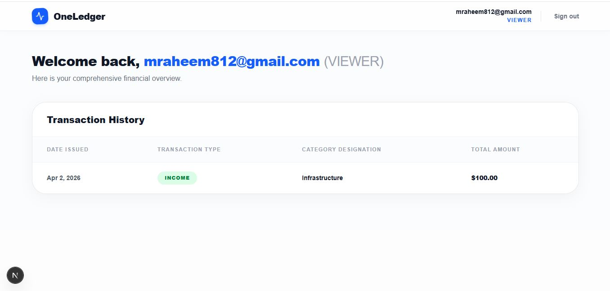
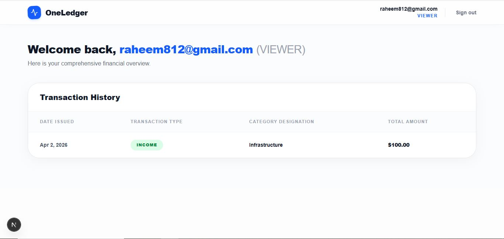
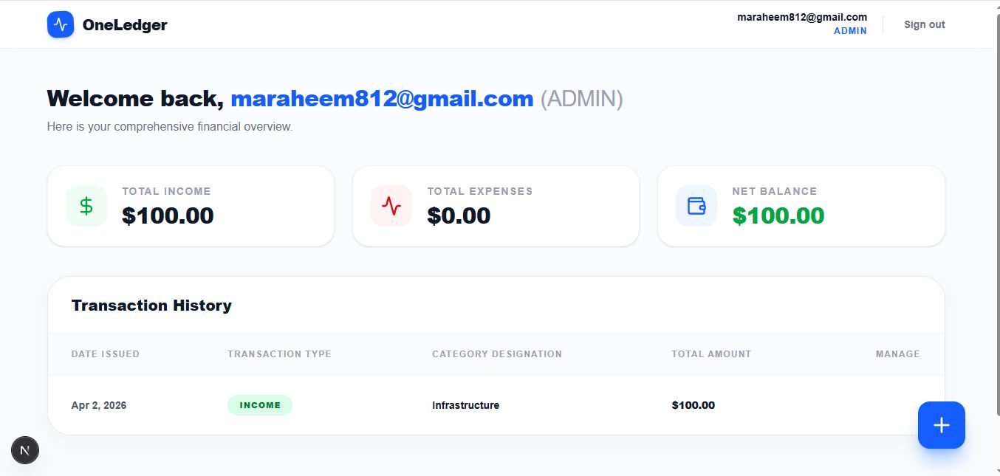

# OneLedger - Task Tracking System

OneLedger is a robust, full-stack Task Tracking System built with Next.js, allowing organizations to manage data records efficiently and securely with strict role-based access controls (RBAC). 

## 🚀 Tech Stack

**Frontend:**
- **Framework:** Next.js (App Router)
- **Styling:** Tailwind CSS
- **Animations:** Framer Motion
- **Icons:** Lucide React / Custom SVG

**Backend:**
- **Framework:** Next.js API Routes (Serverless)
- **Database:** MongoDB
- **ORM:** Mongoose
- **Authentication:** JSON Web Tokens (JWT) & bcryptjs
- **Validation:** Zod

---

## 📸 Screenshots

### 1. Home / Landing Page


### 2. Login Page


### 3. Signup Page


### 4. Dashboard (Viewer Role)

*Viewers have read-only access to browse records.*

### 5. Dashboard (Analyst Role)

*Analysts can view analytics, metrics, and deep insights.*

### 6. Dashboard (Admin Role)

*Admins have full CRUD control over the records and insights management.*

---

## 🛠 Backend Implementation

The backend is fully serverless, operating via Next.js App Router API Routes.

### Authentication & Authorization
- **JWT & bcryptjs:** Passwords are hashed safely before storing them in the database. Upon a successful login, a stateless JSON Web Token (JWT) is generated and issued in a secure HTTP-only cookie.
- **RBAC (Role-Based Access Control):** The middleware protects routes depending on the user's role:
  - `Viewer`: Read operations only.
  - `Analyst`: Extended access to view metrics & insights.
  - `Admin`: Full access (CRUD operations across all resources).

### API Routes Architecture

#### Auth Routes
- `POST /api/auth/signup` - Registers a new user. Performs schema validation via Zod and hashes the password before DB entry.
- `POST /api/auth/login` - Authenticates user credentials and establishes a JWT-based session.

#### Records Management
- `GET /api/records` - Retrieves a list of task records.
- `POST /api/records` - Creates a new task record. (Requires Admin privileges)
- `GET /api/records/:id` - Retrieves a specific record by its ID.
- `PUT /api/records/:id` - Updates an existing record. (Requires Admin privileges)
- `DELETE /api/records/:id` - Permanently deletes a record. (Requires Admin privileges)

#### Dashboard Analytics
- `GET /api/dashboard/summary` - Aggregates database items and computes analytical metrics. (Analyst & Admin only)

---

## ⚙️ Environment Variables Setup

Create a `.env` file in the root directory. Provide the following variables:

```env
# MongoDB Connection String (Required)
# Setup a free cluster at MongoDB Atlas or use a local instance.
MONGODB_URI=mongodb+srv://<username>:<password>@cluster0.mongodb.net/OneLedger?retryWrites=true&w=majority

# JSON Web Token Secret for Signatures (Required)
JWT_SECRET=your_super_secret_jwt_string_here
```

---

## 💻 How to Run the Project Locally

Follow these steps to run the application efficiently on your local environment:

1. **Clone the repository** (if you haven't already):
   ```bash
   git clone <repository_url>
   cd oneledger
   ```

2. **Install dependencies**:
   Ensure you are using Node.js version 18.x or above.
   ```bash
   npm install
   ```

3. **Set up the Environment**:
   Duplicate `.env.example` as `.env`, or manually create the file containing `MONGODB_URI` and `JWT_SECRET`.

4. **Start the Development Server**:
   ```bash
   npm run dev
   ```

5. **Examine the System**:
   Open `http://localhost:3000/` in your browser. Register an account and test the tracking flow.
